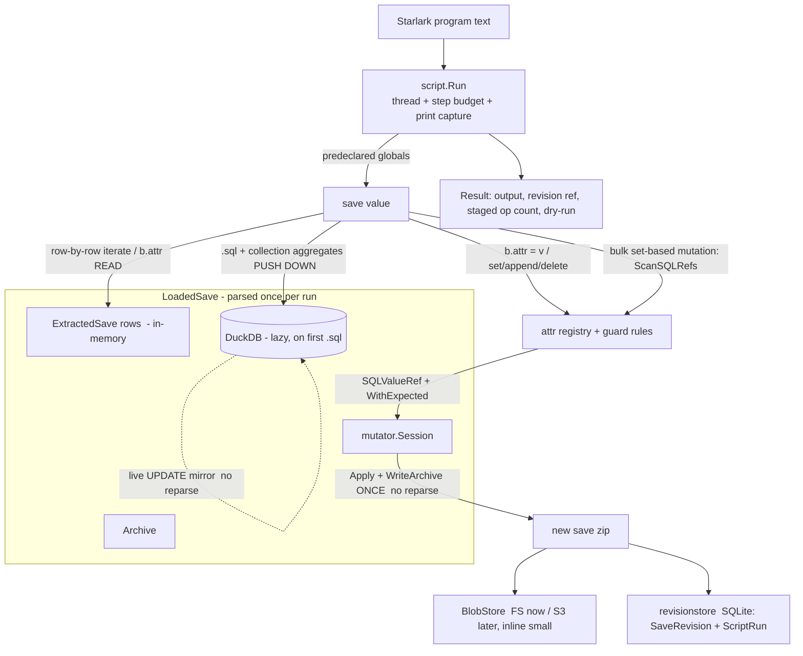

# Plan: Starlark scripting layer over Bibites saves (v1 — language core, one save)

## Context

`bibicontrol` is a Go control plane for The Bibites. Today users can parse a save
(`saveparser/thebibites` → lossless `Archive` + 40+ normalized tables), mutate it
through a staged `Session` (`savemutator/thebibites`), and query it via DuckDB
(`duckdb`). What's missing is the user-facing layer the README promises:
"mutate them through a DSL." We want a real scripting surface so people can
enumerate entities, query, compute, and mutate saves in code — not a rigid DSL.

This PR builds the **language core against a single save**. Workspaces/multi-save,
cross-save transfer, IPC commands, and brain-graph editing are left as thin,
documented seams (already half-present in the repo) and are explicitly out of scope
here, per the "language core on one save" decision and the README's warning against
oversized changes.

### Decision 1 — Host language: **Starlark** (`go.starlark.net`)

You asked for the Starlark-vs-Lua reasoning rather than a pre-made pick. Both are
pure-Go and cross-platform (important: repo bans BepInEx / must run on macOS-ARM).
The deciding factors favor Starlark:

- **Shape match.** Your conceptual examples *are* Starlark (`for b in save.bibites`,
  `dict.get`, `dict.setdefault`, `def`, comprehensions, `%`-formatting). The target
  audience is analytics-minded; Python idioms fit the "massive queries over
  workspaces" future direction. Lua is not Python-shaped and you said you dislike it.
- **Safety / hermeticity — the real differentiator.** Starlark has **no `while`,
  recursion disabled by default, no ambient I/O, frozen module globals, deterministic
  iteration**. For LLM-generated save-mutation scripts this gives near-free
  termination and reproducibility guarantees. Lua (gopher-lua) is a full language with
  `while`/recursion/coroutines — you must actively sandbox it (strip `os`/`io`/`debug`,
  install instruction-count hooks) to reach the same safety bar.
- **Replayability for the distributed future.** The architecture doc wants script runs
  "recordable and replayable." Starlark's determinism makes a recorded `ScriptRun`
  replay identically on another agent — a concrete win for the eventual coordinator.
- **Effort is a wash.** The bulk of the work is the domain bindings (`save.bibites`,
  attribute get/set, `save.sql`, mutators); that's identical for any host. So Starlark
  is not meaningfully more work than Lua.
- **The one Starlark limitation** — no unbounded loops — is acceptable: entity work is
  bounded iteration, and `save.sql(...)` is the escape hatch for anything set-shaped.
- **If LLM familiarity ever outweighs Python-shape**, `goja` (JS) is the natural swap;
  the engine package is structured so a second host could bind the same domain objects.

### Decision 2 — Blob persistence: file blobs + SQL metadata, S3-ready, small items inline

Per your answer: committed saves are written to a content-addressed **`BlobStore`**
(local filesystem now, S3 behind the same interface later); blobs below an inline
threshold are stored directly in the metadata row; revision/provenance **metadata
lives in SQL** (SQLite via pure-Go `modernc.org/sqlite`, matching the architecture
doc's "SQLite as operational source of truth" and the cgo-free cross-platform
constraint). Scope is just the revision/provenance tables, not the full operational
schema.

**Boundary (important):** the blobstore + revisionstore are a *downstream
persistence/provenance sink*, **not** part of the mutation path. They are touched
**only at commit time (T8)**: the mutator produces a normal save zip and these record
its bytes + metadata. The mutation machinery — `Session.StageSQLSet`, guards, the
DuckDB live-mirror, `Apply` + `WriteArchive` — never references them. Concretely, **T6
(mutations) commits to a plain temp file and has zero dependency on either store**; the
coupling appears only in T8. No "mutator layer" lives in the blobstore.

### New dependencies
- `go.starlark.net` (Starlark interpreter, pure Go).
- `modernc.org/sqlite` (pure-Go SQLite driver for `database/sql`, cgo-free).

## Architecture / data flow



**Two read paths, by intent.** Plain enumeration / single-entity attribute access is
served from the in-memory `ExtractedSave` (no DuckDB). **Anything analytical — scanning
many rows, math, aggregation, `GROUP BY` — pushes down to DuckDB**, which is a
vectorized, multi-threaded, in-process columnar engine: this is the non-slow path for
hundreds of thousands to millions of rows. The trap to avoid (and which this design
does *not* make primary) is materializing millions of `Bibite` Starlark values to
aggregate in the interpreter.

**Scale fast path (answers "scan millions + do math"):**
- `save.sql(query)` — raw DuckDB, first-class, the guaranteed-fast fallback for any
  analytical query (joins, `GROUP BY`, window functions, quantiles, arbitrary math).
- Entity collections are **query-backed**, not plain iterators. `save.bibites` carries a
  SQL source (table + standard joins + a `WHERE`). `.where("sql expr")` narrows it
  (returns a new unmaterialized collection); `.count()`, `.sum/mean/median/min/max(col)`,
  `.quantile(col, q)`, `.group_by(col)` **compile to `SELECT agg(col) FROM <source>
  WHERE <pred>`** and return scalars/dicts without materializing rows.
- **Bulk set-based mutation** runs through the same engine: `save.sql(<select locator
  cols>) → duckdb.ScanSQLRefs → Session.StageSQLSet(WithExpected)` mutates a whole result
  set in one staged batch, with stale-value guards, no per-object interpreter overhead.
- Host-side `median(list)`/`sum(list)` builtins remain, but only for small,
  already-materialized lists; iterating `save.bibites` materializes lazily/in batches and
  is for row-by-row logic, not aggregation.
- **Forward-compatible:** the same collection + `save.sql` API is what scales into the
  cross-save/workspace "millions across revisions" future via the architecture doc's
  DuckDB + Parquet analytics direction; v1 just points it at one save's in-memory DB.

**Churn-avoidance (your stated concern) is structural:** one `ParseFile` +
`ExtractTables` per run; DuckDB opened lazily on first `.sql()`/aggregate and then
reused; all mutations staged on a single `Session` and flushed by **one** write at the
end. Dry-run skips the write. See the next section for the in-run `query → mutate →
query` consistency model that avoids any mid-run reparse.

## Execution & consistency model (in-run read-after-write without reparse)

**Problem (grounded in the code).** Three facts make a naive `query → mutate → query`
loop on one save slow:
- `Session.Commit` (`savemutator/thebibites/session.go:182`) writes the zip **and
  reparses it** (`tb.WriteArchive` → `tb.ParseFile`). A full reparse per round-trip is the churn.
- `Session.Apply` updates only entry JSON/raw bytes; it explicitly leaves **parser
  projections invalid** until a reparse (`session.go:21-23`), and `ExtractTables`
  (`saveparser/thebibites/normalize.go:9`) reads those projections (`archive.Bibites`, …),
  **not** `entry.JSON`. So normalized rows cannot be cheaply re-derived from an applied
  archive — re-derivation is gated behind the expensive `ParseFile`.
- `Session.Stage` refuses to stage after `Apply` (`session.go:98`), so the only way the
  current lifecycle makes a staged mutation observable is a full `Commit` (reparse).

**Design: DuckDB is the live in-run view; the Session is an append-only staged journal.**
We never `Apply` mid-run. Each mutation is (a) staged on the Session for the eventual
single write, and (b) mirrored into the open DuckDB as a direct `UPDATE`, so later queries
observe it with **no reparse and no re-extract**.
- **Contract — snapshot + staged scalar writes.** In-run SQL sees the save as of run start
  plus every scalar/bulk `set` applied so far. Structural adds/deletes (append/delete
  entity, zone append/delete) are staged for commit and become visible only after commit —
  documented, not mirrored mid-run in v1.
- **Mirror = the same `SQLValueRef`, the other direction.** A `set` already yields
  `(table, column, locator, value)`: staging builds the archive op, and the mirror builds
  `UPDATE <table> SET <column> = ? WHERE save_id = ? AND <locator>` against the same
  normalized DuckDB schema. `where(...).set(...)` is a single set-based `UPDATE`.
- **Batched & deferred (no O(N²), no churn).** Per-`set` intents are buffered and DuckDB is
  marked dirty; the buffer is flushed **only when the next `.sql()`/aggregate runs** (or
  never, if no query follows), as **one `UPDATE … FROM (VALUES …)` per (table, column)**
  (grouped by column → type-homogeneous). A row-by-row `for b in …: b.x = …` followed by a
  query costs one batched flush, not N point-updates and not a reparse. Lazy DuckDB open
  flushes the pending buffer once right after import, so mutation/open ordering is irrelevant.

**Commit optimization (orthogonal).** The scripting persistence step (T8) commits with
`Session.Apply()` + `tb.WriteArchive(path, Session.Archive())` and **skips the
`tb.ParseFile` reparse** — DuckDB served every read and the run is over, so the fresh
projections `Commit` would return are unused. This removes the reparse half of the write
cost. Reparse-verify is opt-in (`--verify`, re-reading the written save to assert round-trip).

**No changes to the existing mutator.** The Session stays a pure staged journal (never
`Apply` until the final flush), so this needs no edits to tested `savemutator` code; the
mirror and write-only commit live entirely in the new binding/persistence layer.

## Tickets

Nine tickets, each independently shippable with its own tests and definition of done
(DoD), per the repo's per-PR testing discipline. Dependency graph:

```
T1 blobstore ─┐
              ├─► T8 persistence + provenance (host API)
T2 revisionstore (needs T1.Ref) ─┘
T3 engine ─► T4 read bindings ─┬─► T5 analytics
                               └─► T6 scalar set ─┬─► T7 settings (needs T10)
                                                  ├─► T8
                                                  ├─► T10 validation guards
                                                  ├─► T11a entity delete
                                                  └─► T11b array append/delete
T9 IPC seam (independent — only existing ipc/noderuntime)
```
Critical path: **T3 → T4 → T6 → T8**. T1/T2/T3/T9 can start in parallel.

---

### T1 — `blobstore/`: content-addressed blob storage
- **Status:** Resolved 2026-06-15 in isolation.
- **Goal:** durable, dedup'd storage for committed save bytes; FS now, S3-shaped later, small blobs inline.
- **Files:** `blobstore.go` — `type Store interface { Put(ctx, []byte) (Ref, error); Get(ctx, Ref) ([]byte, error); Has(ctx, Ref) (bool, error) }`, `Ref{ SHA256 string; Size int64; Inline []byte }`. `fsstore.go` — `FSStore` rooted at a managed dir, sharded `objects/ab/cd/<hash>`; blobs `< InlineThreshold` (e.g. 4 KiB) returned as `Inline` rather than written.
- **Resolution:** implemented `blobstore.Store`, `Ref`, and `FSStore`; `FSStore` now delegates filesystem blob I/O to Go CDK's `gocloud.dev/blob/fileblob` while preserving this package's content-addressed refs, sharded object keys, dedupe, inline-small-blob behavior, and verified reads. `FSStore.Close` releases the underlying bucket.
- **Deps:** none. **New module dep:** `gocloud.dev v0.45.0` (pinned because `v0.46.0` requires Go 1.25; this repo remains on Go 1.24).
- **DoD / tests:** put/get round-trip; identical content dedupes to one object; inline-threshold boundary returns inline vs writes file. S3 impl explicitly out of scope (interface kept clean).
- **Verification:** `GOMODCACHE=/tmp/bibicontrol-go-mod GOCACHE=/tmp/bibicontrol-go-build go test ./blobstore`.

### T2 — `revisionstore/`: SQLite revision + provenance metadata ("metadata in SQL")
- **Status:** Resolved 2026-06-16 in isolation.
- **Goal:** record every produced save revision and the script run that produced it.
- **Files:** `schema.sql` (embedded migration) — `save_revisions(id, sha256, size, parent_id, source_path, blob_ref, inline_blob BLOB NULL, script_run_id, created_at)`, `script_runs(id, script_sha256, started_at, finished_at, status, error, output, staged_ops, dry_run)`. `store.go` — `Open(path)` (applies migration), `RecordScriptRun`, `RecordRevision`, lookups by id/sha. Reuse the `//go:embed` + ordered-apply pattern from `duckdb/import.go`.
- **Resolution:** implemented `revisionstore.Store` over `database/sql` + pure-Go `modernc.org/sqlite`; added an embedded SQLite schema for `script_runs` and `save_revisions`; revisions persist `blobstore.Ref` metadata as JSON while storing inline bytes in `inline_blob`; lookups cover script run by ID, revision by ID, and revisions by SHA-256. `modernc.org/sqlite` is pinned to `v1.45.0`, the newest checked release that keeps `go 1.24.0`.
- **Deps:** T1 (stores a `blobstore.Ref`). **New module dep:** `modernc.org/sqlite v1.45.0` (pure-Go, cgo-free).
- **DoD / tests:** record + read back a run and its produced revision; parent linkage; inline-blob vs blob_ref path both persist and reload.
- **Verification:** `GOMODCACHE=/tmp/bibicontrol-go-mod GOCACHE=/tmp/bibicontrol-go-build go test ./revisionstore`; `GOMODCACHE=/tmp/bibicontrol-go-mod GOCACHE=/tmp/bibicontrol-go-build go test ./...`.

### T3 — `script/`: Starlark host engine (domain-neutral)
- **Status:** Resolved 2026-06-16 in isolation.
- **Goal:** a reusable, sandboxed Starlark runner with budgets and clean diagnostics; no Bibites types.
- **Files:** `engine.go` — `Run(ctx, program []byte, globals starlark.StringDict, opts Options) (Result, error)`: `starlark.Thread`, `thread.SetMaxExecutionSteps` (budget), `thread.Print` → captured buffer, `*starlark.EvalError` backtraces → diagnostics. `result.go` — `Result{ Output string; Diagnostics []Diagnostic; StagedOps int; RevisionRef string; DryRun bool }`.
- **Resolution:** implemented a domain-neutral `script` package with `Run`, `Options`, `Result`, `Diagnostic`, and `RunError`; the runner captures `print` output, uses `starlark.ExecFileOptions` with explicit `syntax.FileOptions`, enforces optional execution-step budgets through `Thread.SetMaxExecutionSteps`, propagates context cancellation through `Thread.Cancel`, and normalizes syntax/eval/budget/cancellation failures into clean diagnostics with source locations and eval backtraces.
- **Deps:** none. **New module dep:** `go.starlark.net v0.0.0-20260324133313-ffb3f39dd27a` (pinned to the newest checked commit before the upstream `go 1.25.0` module bump; this repo remains on Go 1.24).
- **DoD / tests:** trivial program prints + returns; step budget aborts a long bounded loop; syntax/eval error surfaces a clean diagnostic. (Starlark's lack of `while`/recursion gives hermeticity for free.)
- **Verification:** `GOMODCACHE=/tmp/bibicontrol-go-mod GOCACHE=/tmp/bibicontrol-go-build go test ./script`; `GOMODCACHE=/tmp/bibicontrol-go-mod GOCACHE=/tmp/bibicontrol-go-build go test ./...`.

### T4 — `script/thebibites/`: LoadedSave + read bindings (enumerate + attribute reads)
- **Status:** Resolved 2026-06-15 in isolation.
- **Goal:** load a save once and expose read-only entity enumeration and friendly attribute reads. First user-visible vertical slice (a script can read and print).
- **Files:** `loadedsave.go` — `Load(path) (*LoadedSave, error)` → `ParseFile` + `ExtractTables`; holds `*tb.Archive`, `tb.ExtractedSave`, lazily-opened `*sql.DB` (via `duckdb.OpenAndImport`), and a `*mutator.Session` (`mutator.NewSession(archive)`). `attr_registry.go` — **data-driven friendly-attribute table** assembled from `tb.NormalizedTables` + the generated `*ColumnPaths` maps, keyed by entity kind; each entry `{friendlyName, sourceTable, sourceColumn, writable, guard, alias}`; writability inferred from the `sqlrefresolver` tag; a small hand-maintained `overrides` map for renames/aliases (`Diet`→`diet`, brain `type_name`). `bibite_value.go` (reads only here) — `Bibite` `starlark.Value` + `HasAttrs`; `Attr(name)` resolves via registry against the in-memory joined `ExtractedSave` rows; `b.gene("Name")`. `collection.go` (iteration only here) — `EntityCollection` behind `save.bibites`/`save.eggs`, a lazy `starlark.Iterable` yielding `Bibite`. `save_value.go` (read attrs only). `bindings.go` — `Globals(ls)`.
- **Resolution:** implemented the `script/thebibites` package: `LoadedSave`/`Load` parse + extract a save once and hold the lazy `*sql.DB` (nil in T4) and `*mutator.Session` seams; a friendly-attribute `registry` built **entirely from `tb.NormalizedTables`** (identity table + 1:1 sub-tables joined by `entry_name`), so every generated column is readable with no hand-maintained allowlist and `attrSpec` carries an `attrCategory` seam for future joined sub-collections. `Entity` (shared by bibites/eggs) implements `starlark.HasAttrs` with data-driven `Attr`/`AttrNames` + a `gene("Name")` point-lookup builtin and a `b.genes` read-only `GeneCollection` (lazy `starlark.Iterable`/`Sequence` yielding `Gene{.name,.value,.type}`). Both gene paths share one lazily built `geneSet{order, byName}` per entity — `gene()` stays O(1) via `byName`, `genes` iterates `order` in save order — the first concrete use of the `attrCategory` sub-collection seam. `EntityCollection` is a lazy `starlark.Iterable`/`Sequence`; `Globals(ls)` binds `save`. Reads are served from the in-memory `ExtractedSave` — DuckDB is never opened. Deviations: derived the registry from `NormalizedTables` alone (the `*ColumnPaths` maps are unexported and redundant); unified bibite/egg into one `Entity` type to avoid duplication.
- **Deps:** T3. **New module dep:** none beyond T3.
- **DoD / tests (fixtures in `testdata/saves/the-bibites/`):** enumerate `save.bibites`; read attributes match normalized values; arbitrary gene read; missing attr → clean error. No mutation, no DuckDB yet (iteration is in-memory). Tests assert the mechanism (sampled identity + sub-table columns round-trip, `gene()` point read, `b.genes` iteration whose values agree with `gene()` lookups, unknown attr → `nil`/diagnostic, end-to-end `script.Run`, `ls.db` stays nil), not an allowlist.
- **Verification:** `GOMODCACHE=/tmp/bibicontrol-go-mod GOCACHE=/tmp/bibicontrol-go-build go test ./script/thebibites`; `GOMODCACHE=/tmp/bibicontrol-go-mod GOCACHE=/tmp/bibicontrol-go-build go test ./...`.

### T5 — analytics: SQL push-down + raw `save.sql` + aggregate builtins
- **Status:** Resolved 2026-06-15 in isolation.
- **Goal:** the non-slow path for "scan many rows + do math" — push computation into DuckDB.
- **Files:** `sql.go` — lazy DuckDB open (flushing any pending mirror buffer once after import); `save.sql(query)` raw fallback → `list[dict]`; the push-down query builder; a **`flushMirror()` hook + dirty flag** called at the head of every query/aggregate so reads observe pending mutations (the buffer itself is filled by T6). Extend `collection.go` — `.where(expr)` (narrowed copy), `.count()`, `.sum/mean/median/min/max(col)`, `.quantile(col, q)`, `.group_by(col)`, each compiling to `SELECT agg(col) FROM <source> WHERE <pred>` (no row materialization). `aggregates.go` — free-standing `median/mean/sum/count/min/max` over Starlark iterables, **for small materialized lists only**, documented as such.
- **Resolution:** added the analytics surface in `script/thebibites`. `loadedsave.go` gained a lazy idempotent `openDB` (opens DuckDB at most once per run via `duckdb.OpenAndImport`, no reparse) and a no-op `flushMirror()` + `mirrorDirty` seam called at the head of every query (T6 fills the buffer). `sql.go` holds `save.sql(query) → list[dict]`, the push-down builder, friendly-column resolution, and `rewritePredicate` — a lightweight identifier tokenizer that **qualifies friendly column names inside raw `.where()` strings** (essential because generated columns collide across joined sub-tables, e.g. `body_id`), leaving keywords/functions/literals/quoted refs untouched. Both aggregate/group columns **and** predicate columns resolve through the **same generated-metadata `attrRegistry()`** — no parallel allowlist. **SQL source = identity table LEFT JOIN only the referenced 1:1 sub-tables** on `(save_id, entry_name)`, so every friendly column (identity or sub-table) is aggregatable; 1:1 joins keep cardinality exact. `collection.go` makes `EntityCollection` a `HasAttrs` with `.where/.count/.sum/.mean/.median/.min/.max/.quantile/.group_by` and adds `GroupedCollection` (aggregates return a dict keyed by group value); `entityIterator` bumps a `rowsMaterialized` counter so tests prove aggregates never materialize entities. `convert.go` gained `fromSQLValue` (reverse of `toStarlark` over driver scalars; SQL NULL → None). Host `sum/mean/median` attach via `Globals`. **Deviations:** host builtins are `sum/mean/median` only — `count/min/max` would shadow the Starlark universe's `len/min/max`, and the push-down `.count/.min/.max` cover that path; `duckdb.normalizeSQLScanValue` is unexported, so `fromSQLValue` folds its driver-type coercion in directly; DuckDB queries use a background context (Starlark's step budget bounds the run) with ctx-threading marked as a seam.
- **Deps:** T4. **New module dep:** none.
- **DoD / tests:** `save.sql` returns expected rows; push-down `where(...).median("energy")` and `group_by("species_id")` match equivalent raw `save.sql` and equal the host-side builtin over the materialized list; on the 1027-bibite fixture a `group_by` aggregate returns **without** hitting the `Bibite` row-materialization path (assert via a counter); DuckDB opened at most once per run and reused; flush hook is a no-op when nothing is dirty. Added: a collision-forcing predicate (sub-table column + colliding `body_id`) resolves and runs; an unknown `.where()` column surfaces a diagnostic naming the predicate; `rewritePredicate` leaves keywords/functions/string literals intact.
- **Verification:** `GOMODCACHE=/tmp/bibicontrol-go-mod GOCACHE=/tmp/bibicontrol-go-build go test ./script/thebibites`; `GOMODCACHE=/tmp/bibicontrol-go-mod GOCACHE=/tmp/bibicontrol-go-build go test ./...`.

### T6 — entity scalar mutations (stage + commit-to-file + reparse)
- **Status:** Resolved 2026-06-16 in isolation.
- **Scope (revised 2026-06-16):** narrowed to **scalar set only** — per-entity `SetField` (`b.energy = x`) + bulk `where(...).set(col, <constant>)`, the DuckDB live-mirror + batched flush, the stale-value guard (`WithExpected`), and commit-to-file + dry-run. The **validation guard layer is split out to T10**; **structural append/delete is split out to T11a (entity delete) / T11b (array append/delete)**. Read-only / unknown / non-scalar sets still error cleanly via the generated `attrSpec.writable` (`field.SQLRefPath != ""`) — basic correctness, not the T10 guard layer.
- **Resolution:** implemented scalar mutation on the existing T4/T5 `script/thebibites` package, consuming the mutator/duckdb surface with **no changes to `savemutator` or `duckdb`**. `entity.go` gained `SetField` (now `*Entity` is `starlark.HasSetField`): registry lookup → `attrSpec.writable` gate → capture current value as the stale guard → `fromStarlark` → `setRowField` (kind-aware coerce + in-memory write-through) → `session.StageSQLSet(ref.WithExpected(old), staged)` → `recordMirror`. The locator is built by `entityLocatorRef` reading `body_id`/`egg_id` + `has_*` generically from the identity row through the same generated registry (no parallel allowlist). `mirror.go` holds the deferred buffer (`(table,column) -> entry_name -> value`, last-write-wins) and `flushMirrorColumn` (one `UPDATE … FROM (VALUES …) AS v(entry_name, val)` with `CAST(? AS <sqltype>)` per column); `loadedsave.go`'s `flushMirror` body drains it (one statement per column, counted) and `WriteSave` does `Apply` + `tb.WriteArchive` with no reparse. `collection.go`/`sql.go` add bulk `where(...).set(col, <constant>)` via the same push-down builders + `duckdb.ScanSQLRefs` → batched `StageSQLSet`. `save_value.go` adds `save.commit(path)` honoring `dryRun`. `convert.go` gained `fromStarlark`/`goScalar`/`setRowField`. **Deviations:** (1) per the scope decision, the validation guard layer and structural ops moved to T10/T11a/T11b; the stale-value guard stays. (2) Added in-memory **write-through** so a plain `b.energy` read observes a prior set in the same run (the DoD only required the SQL path); both read paths are now consistent. (3) Bulk set takes a Starlark scalar constant; per-row SQL expressions are a documented seam. (4) `stagedOps` is tracked on `LoadedSave` (commit/Result), avoiding a Session accessor and keeping the mutator untouched. (5) The mirror UPDATE keys on `entry_name` alone (unique per entity within a save), and `setRowField` is the only typing T6 performs (memory safety + JSON type fidelity), not the T10 value-validation layer.
- **Goal:** mutate entity scalar attributes safely, keep DuckDB consistent in-run without reparse, and produce a corrected save file. Complete write slice, verifiable without the blob/revision stack (writes a temp zip via `Session.Apply` + `tb.WriteArchive`, then reparses only the test assertion).
- **Files:** extend `bibite_value.go` — `HasSetField`; `SetField(name, v)` → registry lookup → guard → build `mutator.SQLValueRef` (locator `entry_name`/`body_id`) → `session.StageSQLSet(ref.WithExpected(oldVal), newVal)` **and record a mirror intent** `(table, column, locator, value)`. `mirror.go` — the deferred mirror buffer + `flushMirror()` (one `UPDATE … FROM (VALUES …)` per (table, column), grouped by column for type-homogeneity) called by T5's query hook; structural ops mark the buffer "structurally deferred" rather than mirroring (per the consistency contract). `save_value.go` — `.set/.append/.delete` generic mutators; `.commit(path)` (Apply + WriteArchive, no reparse) and dry-run. Bulk path in `sql.go` — `save.bibites.where(...).set(col, expr)` via `duckdb.ScanSQLRefs` → `[]SQLRefRow` → batched `StageSQLSet(row.Ref.WithExpected(row.CurrentValue), v)`, mirrored as a single set-based `UPDATE`. `guards.go` — `Rule{ReadOnly, Min/Max, Enum, Type}` checked before staging; seeded from column `value_type` + manual overrides (`species_id` referential, `dead`/`dying` bool-only, energy/health ≥ 0); bulk validates once per column.
- **Deps:** T4 (and T5 for the query/flush hook + bulk `where(...).set` path; if sequenced before T5, ship per-entity `SetField` + staging first and wire the mirror flush when T5 lands). **New module dep:** none.
- **DoD / tests:** `b.energy = x` → write temp → reparse shows field changed, unrelated entries keep SHA256; guard rejects out-of-range/readonly/wrong-type; stale-value guard fires when underlying value changed; **in-run `query → set → query` observes the new value with no `ParseFile` and no `ReplaceExtractedSave` (assert via reparse/re-import counters)**; **N row-by-row sets followed by one query flush as a single batched `UPDATE`, not N point-updates (assert statement count / not O(N²))**; bulk `where(...).set(...)` stages one batch and mirrors as one `UPDATE`; structural append is *not* visible to an in-run query but *is* present after commit; dry-run stages but writes nothing. (Implemented subset: `mutation_test.go` covers persisted set + unrelated-entry SHA256 stability, in-run `set → save.sql` read-after-write with `dbOpenCount==1` and one mirror UPDATE, N sets → one batched flush, bulk `where().set`, the stale-value guard rejecting a mismatched expected, clean read-only/unknown/non-scalar errors, dry-run writing nothing, and an end-to-end scripted set+commit. Structural-append visibility moves to T11b.)
- **Verification:** `GOMODCACHE=/tmp/bibicontrol-go-mod GOCACHE=/tmp/bibicontrol-go-build go test ./script/thebibites`; `GOMODCACHE=/tmp/bibicontrol-go-mod GOCACHE=/tmp/bibicontrol-go-build go test ./...`.

### T7 — `save.settings`: settings reads + writes
- **Goal:** named key/value settings access — a different shape from entity collections.
- **Files:** `settings_value.go` — `save.settings` namespace (`simulation`/`independent`/`material("X")`/`zones[i].values`). Reads from in-memory settings rows (`SettingsSimulationValues`, …), typed by `ScalarType`. Each read yields a `Setting` handle retaining its full locator (`entry_name`, `scope`, `owner_kind`, `owner_id`, `setting_name`, `path`, `wrapper_raw_json`, `value_type` — all present on `SettingValueRow`); `.set(value)` rebuilds the exact `SQLValueRef` → `session.StageSQLSet(ref.WithExpected(current), v)` through the existing `settings_value` resolver (`savemutator/thebibites/sqlref_settings.go`). Guards reuse `guards.go` keyed by `scope/setting_name`. Zones/materials/changers enumerable read-only.
- **Deps:** T6 (StageSQLSet + commit) and T10 (reuses `guards.go`). **New module dep:** none.
- **DoD / tests:** `save.settings.simulation["maxBibiteCount"].set(v)` round-trips through reparse; wrapper-vs-bare value handled (`settingValueUsesWrapper`); guard rejects wrong-type; zone-scoped value write hits the right index.
- **Stretch (gate separately):** intra-save clone of a zone/material/changer via append of source `RawJSON` through the `settings_zone_path_map` append target (`sqlref_settings.go:227`).

### T8 — persistence + provenance (end-to-end host API)
- **Status:** Resolved 2026-06-16.
- **Scope (revised 2026-06-16):** the `cmd/bibiscript` CLI is **dropped** per the project
  decision that the primary consumer is a UI / Starlark editor, not a terminal. The
  deliverable is a host-callable Go orchestration API; an end-to-end test plays the role the
  CLI verification would have. Commit is **host-driven auto-commit** with a **script-declared
  intent** (`autocommit(enabled=True)`, default yes).
- **Goal:** wire commits into content-addressed storage + SQL provenance behind a single host
  entry point a UI backend can call.
- **Resolution:** `script/thebibites/run.go` adds `RunAndCommit(ctx, savePath, program, blobs,
  revs, RunOptions{Filename, MaxExecutionSteps, DryRun, Verify})` (and the in-package
  `runLoaded` core tests inspect counters through): load once → `script.Run` with `Globals(ls)`
  → `revs.RecordScriptRun` (always, even on failure / read-only) → and, when the run succeeded,
  is not dry-run, the script left commit intent on, and `stagedOps > 0`, `ls.Commit(...)`.
  `loadedsave.go` gains `LoadedSave.Commit(ctx, blobs, revs, scriptRunID, verify)`:
  `ensureApplied()` (idempotent `Session.Apply`, so a script's own `save.commit(path)` does not
  double-apply) → `tb.WriteArchiveTo(&buf, …)` serialize to bytes (**no temp file, no
  reparse**) → `blobs.Put` → `revs.RecordRevision` linked to the run. Opt-in `verify` writes
  the bytes to a temp file and `tb.ParseFile`s once (the only archive parser is path-based),
  asserting the reparsed whole-file SHA256 equals the blob ref. `bindings.go` adds the
  predeclared `autocommit(enabled=True)` builtin (sets `ls.willCommit`). **Deviations:** (1) no
  CLI (above). (2) `recordedDryRun = host DryRun || !willCommit` — the `script_runs.dry_run`
  flag records the *intent* "this run produced no revision," covering both the host override
  and the script opt-out (no schema change to the resolved T2 store). (3) `RevisionInput.ParentID`
  is nil in v1 — the input save is not itself a recorded revision, so lineage chaining is a
  documented seam. (4) `save.commit(path)` (T6) stays as an orthogonal plain-file export, not
  the provenance path. (5) instrumentation `writeArchiveCount`/`reparseCount` added to
  `LoadedSave` alongside `dbOpenCount` so the churn DoD is assertable.
- **Files:** `script/thebibites/run.go` (new), `script/thebibites/loadedsave.go` (`Commit`,
  `ensureApplied`, `verifyRoundTrip`, counters, `willCommit`), `script/thebibites/bindings.go`
  (`autocommit`), `script/thebibites/commit_test.go` (new).
- **Deps:** T1, T2, T6 (benefits from T5/T7). **New module dep:** none beyond T1/T2.
- **DoD / tests (`commit_test.go`):** a mutation run produces a blob + linked
  `save_revisions`/`script_runs` rows, the produced save (re-read) shows the change and an
  unrelated entry stays byte-identical; `DryRun` records a run with `dry_run=1` and writes no
  blob; `autocommit(False)` stages mutations but produces no revision (recorded dry); **churn
  assertion — a pure-mutation run does exactly one `WriteArchive`, zero reparses, and never
  opens DuckDB** (`writeArchiveCount==1`, `reparseCount==0`, `dbOpenCount==0`); `Verify` adds
  exactly one reparse and asserts the round-trip hash.
- **Verification:** `GOMODCACHE=/tmp/bibicontrol-go-mod GOCACHE=/tmp/bibicontrol-go-build go test ./script/thebibites`; `GOMODCACHE=/tmp/bibicontrol-go-mod GOCACHE=/tmp/bibicontrol-go-build go test ./...`.

### T9 — thin IPC command seam (`control/`)
- **Goal:** typed client-side command definitions over the existing transport, ready for the DLL later.
- **Files:** `control/commands.go` — typed STOP/INFO/RESUME/RELOAD builders over `ipc.Envelope` via `noderuntime.Runtime.Request/Notify`, returning typed responses; small dispatcher/registry. DLL side stays out of scope (architecture doc).
- **Deps:** none (existing `ipc`/`noderuntime`). **New module dep:** none.
- **DoD / tests:** envelope-shape assertions against a fake/loopback session (no real DLL); unknown command rejected.

---

> **Expanded mutator path (split out of T6 on 2026-06-16; T11 sub-split on 2026-06-16).**
> T6 shipped scalar set only; the three stubs below (T10, T11a, T11b) carry the rest of the
> entity-mutation surface so T6 stays small. All build on T6's `SetField`/bulk-set/mirror
> plumbing, and the mutator primitives they consume (`StageSQLSet`/`StageSQLDelete`/
> `StageSQLAppend`, `DeleteOptions`, `SceneCount` reconciliation) already exist and are
> tested in `savemutator` — these tickets are largely binding-layer work (the one
> exception: T11a also adds `activeSpeciesList` reconciliation to the `savemutator`
> delete cascade).

### T10 — entity mutation validation guards
- **Status:** Resolved 2026-06-16. Split out of T6.
- **Goal:** validate the *new* value before staging — type, range, enum — plus friendly read-only diagnostics, layered on top of T6's scalar set.
- **Resolution:** added `script/thebibites/guards.go` as a **binding-layer** validation run *before* staging (no `savemutator`/`duckdb`/`saveparser`/generator changes; the mutator's `WithExpected` stale-guard stays orthogonal). The **`Type` rule is derived 1:1 from `attrSpec.sqlType`** via `deriveType` (`DOUBLE→number`, `BIGINT→int`, `UBIGINT→uint`, `BOOLEAN→bool`, `TEXT→string`; unknown→no type check so a new generated type isn't wrongly rejected) — no per-column allowlist; its accept policy reuses `asFloat64`/`asInt64` so it matches `setRowField` exactly (int↔float promotion, integral-float ints, unsigned non-negativity). `Rule{Type, Min, Max, Enum}` + pure `validateValue` are wired through `validateSet(spec, goVal)` into `Entity.SetField` (after `fromStarlark`, before `setRowField`) and `bulkSet` (after `fromStarlark`, **before the query** — so the bulk path validates once per column and rejects even when the predicate matches zero rows). Read-only stays gated by `attrSpec.writable`, message enriched ("derived or locator column, not writable"). **Deviations from the stub:** (1) `Rule` has no `ReadOnly` field — read-only is already derived and gated upstream, not a value-domain rule. (2) `dead`/`dying` "bool-only" needs no override — it falls out of the derived `BOOLEAN→kindBool` type rule. (3) per the user's scope choice, the semantic `overrides` map (`semanticRules`) is the **"broader non-negatives"** set: `Min: 0` on the ~24 writable signed quantities that are physically non-negative (`energy`, `health`, `time_alive`, `generation`, `species_id`, `transform_scale`, body/mouth/egg-layer counts & amounts, progress/distance fields), grounded against `tb.NormalizedTables`; signed values (positions, velocities, rotations, `corpse_energy_offset`) are excluded and `UBIGINT` is omitted (non-negative by type). (4) `species_id` is **shape-only non-negative** — the same `Min: 0` mechanism, *not* a referential checker; true referential existence is a documented seam, which keeps `validateSet` pure (no species-table access). (5) the `Enum` rule is implemented but **unseeded for entities** — no writable entity *scalar* column is a string enum (`material`/`type_name` live in excluded 1:many tables); it exists for T7 settings reuse and is unit-tested directly.
- **Files:** `script/thebibites/guards.go` (new), `script/thebibites/guards_test.go` (new), `script/thebibites/entity.go` (`SetField` wire + read-only message), `script/thebibites/sql.go` (`bulkSet` wire), `script/thebibites/convert.go` (doc comments).
- **Deps:** T6. **New module dep:** none.
- **DoD / tests (`guards_test.go`):** out-of-range rejected (with inclusive-0 boundary + int→float promotion accepted); wrong-type rejected with a diagnostic naming the attribute; bulk validates once, pre-query (rejects with a zero-match predicate, nothing stages/flushes); a meta-test asserts every writable column derives a `Type` from `sqlType` alone (no allowlist); a churn-hardening test asserts every `semanticRules` key is a live writable column (drift fails loud/localized, per `save-format-churn-strategy`); the enum mechanism + the full type-acceptance matrix are unit-tested; read-only diagnostic preserved. (T7 settings writes reuse `validateValue`.)
- **Verification:** `GOMODCACHE=/tmp/bibicontrol-go-mod GOCACHE=/tmp/bibicontrol-go-build go test ./script/thebibites`; `GOMODCACHE=/tmp/bibicontrol-go-mod GOCACHE=/tmp/bibicontrol-go-build go test ./...`.

> **T11 sub-split (2026-06-16).** The original T11 bundled whole-entity delete and array
> element append/delete. The two halves differ in size, shape, and prerequisites: entity
> delete is a small entity method reusing existing plumbing, while array ops first require a
> new 1:many sub-collection binding (the next `attrCategory` beyond `categoryScalar` —
> `attr_registry.go:36-38` deliberately excludes 1:many tables today). Split into T11a / T11b
> so the unblocked slice ships independently.

### T11a — structural: whole-entity delete
- **Status:** Resolved 2026-06-16. Split out of T11.
- **Goal:** stage a whole-entity (`bibite`/`egg`) delete, honoring the consistency contract — staged for commit, **not** mirrored mid-run — and keep scenario-level state consistent on delete.
- **Resolution:** added `b.delete(prune=False)` on `Entity` (`script/thebibites/entity.go`), exposed like `gene`/`genes` (a `*Builtin` from `Attr`, listed in `AttrNames`, rejected by `SetField`). `deleteBuiltin` builds the identity ref via the existing `entityLocatorRef`, sets `ref.Table` from `identityTable(kind)`, then stages: bibite **with** prune → `Session.StageDeleteBibiteWithOptions(BibiteRef{…}, DeleteOptions{PruneParentLinks: true})`; otherwise (egg, or bibite without prune) → `Session.StageSQLDelete(ref)` (resolves to `DeleteEntry`). It bumps `stagedOps` and — unlike a scalar set — **does not record a mirror intent**, so the structural change is invisible to an in-run query and surfaces only after commit. The referential guard (refuse orphaning a parent link without prune) and the `nBibites`/parent-child cascade run later inside `Session.Apply`, inherited for free. **Scenario-cascade investigation (prompted by review):** of the scene/scenario state that depends on entity population, bibite delete already reconciles `scene.nBibites` (the only parser-validated count) + `body.eggLayer.children`; eggs need no scene count (no `nEggs`; `children` hold bibite body-IDs, not egg-IDs); there is no global energy/biomass aggregate. The **one real gap was `activeSpeciesList`** (in `speciesData.json`) — *not* parser-validated and reconciled by neither kind. Per the user's call this PR **also extends the mutator** (`savemutator/thebibites/session.go`, the one savemutator change in the T11 family): `applyDeleteEntry` now drops a species id from `activeSpeciesList` when the deleted bibite/egg was its last living member, via helpers `entitySpeciesID`/`speciesHasOtherMembers`/`activeSpeciesIndexOf`/`removeActiveSpecies` mirroring the existing `entriesReferencingChild`/`childIndexOf` pattern. Multi-delete-correct via the accumulating `removed` set; graceful no-op when the save has no species entry/list. **Deviations from the stub:** (1) no `save_value.go` change — delete is a per-entity method on `Entity`, not a save-level mutator. (2) no `mirror.go` change — the "structurally deferred" behavior is realized simply by not recording to the buffer; the existing T6 header comment already documents that structural ops bypass the mirror. (3) prune is a no-op for eggs (no parent links). (4) bulk `where(...).delete()` left as a seam (aligns with T11b's `ScanSQLRefs`). (5) scope grew beyond "binding-layer work" to include the `activeSpeciesList` mutator fix.
- **Files:** `script/thebibites/entity.go` (`deleteBuiltin` + `Attr`/`AttrNames`/`SetField` wiring), `script/thebibites/delete_test.go` (new), `savemutator/thebibites/session.go` (`applyDeleteEntry` species block + 4 helpers), `savemutator/thebibites/append_delete_test.go` (species-reconciliation tests).
- **Deps:** T6. **New module dep:** none.
- **DoD / tests:** whole-entity delete staged → reparse after commit shows the entry gone; referential guard refuses orphaning deletes (prune opt-in via `DeleteOptions.PruneParentLinks`, asserted white-box that the kwarg reaches the staged op's `DeleteOptions`); **a structural change is *not* visible to an in-run query but *is* present after commit** (`flushStmtCount==0`, `dbOpenCount==1`); persisted delete decrements `scene.nBibites` and leaves an unrelated entry byte-identical; egg delete; end-to-end via a Starlark script. Mutator tests: last-member delete drops the species id, non-last keeps it, an **egg** as last member drops it, both members deleted in one batch drops it, and a species-less archive deletes cleanly (no-op).
- **Verification:** `GOMODCACHE=/tmp/bibicontrol-go-mod GOCACHE=/tmp/bibicontrol-go-build go test ./savemutator/thebibites ./script/thebibites`; `GOMODCACHE=/tmp/bibicontrol-go-mod GOCACHE=/tmp/bibicontrol-go-build go test ./...`.

### T11b — structural: array element append/delete
- **Status:** Resolved 2026-06-16. Split out of T11.
- **Goal:** stage array-element append/delete (entity 1:many sub-arrays), staged for commit and **not** mirrored mid-run.
- **Scope (chosen 2026-06-16):** the three **entity** 1:many arrays — `synapses` and `nodes` (bibite + egg), `stomach` (bibite only). **Pellets are out** — they hang off the environment entry, not a bibite/egg, so exposing them needs a new top-level `save.pellets` surface (a documented seam, not this ticket); the `SceneCount` reconciliation path stays covered by the existing mutator pellet tests, and none of the in-scope entity arrays carry a scene count. Append takes **friendly kwargs** (`b.synapses.append(node_in=3, weight=0.4, …)`).
- **Resolution:** implemented the 1:many sub-collection binding + a small mutator extension.
  **Mutator (Part A):** synapses already had `appendArray`/`deleteArray`; added the same for **brain nodes** (`entityNodeAppendTarget`/`entityNodeDeleteTarget`, bibite+egg) and **stomach contents** (`bibiteStomachAppendTarget`/`bibiteStomachDeleteTarget`) in `sqlref_entities.go`, wired via three new `generatedSQLRefTable` switch cases in `sqlref_catalog.go` (the synapse `synapseArrayResolver` generalized to `entityBrainArrayResolver`). No scene count for any of them.
  **Bindings (Parts B/C):** added `categorySubCollection` to the `attrCategory` enum and a data-driven sub-collection registry (`entitySubCollections` + lazily-built `subCollectionSpec`) whose element columns are derived **entirely from `tb.NormalizedTables`** (no allowlist); the array-ordinal `index` column is exposed separately and selects the `SQLValueRef` index field (`setRefArrayIndex`). `subcollection.go` (new, modeled on `gene.go`) holds `ElementCollection` (lazy `Iterable`/`Sequence` + `.append`/`.count`) and `ArrayElement` (`HasAttrs` over element columns + `.index` + `.delete`). `entity.go` dispatches the sub-collection names in `Attr`/`AttrNames` and rejects them in `SetField`; `loadedsave.go` adds a lazy `subRowIdx` (table → entry_name → element rows, in array order) and `subElementRef`. Append builds a `map[jsonKey]value` from friendly kwargs, validates each through T10 `validateSet`, **requires the complete writable column set** so the element is well-formed, then `StageSQLAppend`. Element delete locates by array index and carries a `WithExpected` stale guard on one stable field (`guardColumn`). Both are **structural**: `stagedOps++` but **no `recordMirror`**, so an in-run read/query sees the original set; the change appears only after commit (no `mirror.go` change).
  **Deviations from the stub:** (1) pellets dropped from scope (above); the read/write surface is entity sub-arrays only. (2) append is friendly-kwargs (not raw dict) per the scope decision, reusing `fromStarlark`+`validateValue` since every element field is scalar. (3) element index is the **positional** array index (slice order = parser/array order), not the stored `*_row_index` column, which is exactly what the mutator's `brain.Synapses[i]`/`content[i]` path needs. (4) **brain-graph integrity is a documented limitation** (v2): node/synapse append/delete are raw array edits — no synapse pruning on node delete, no node-index existence check on synapse append; the delete stale guard is the only safety net. (5) bulk `where(...).append/delete` left as a seam.
- **Known limitation — append requires the *complete* writable column set.** `.append(...)` rejects a call that omits any writable element field (a brain node is 10 fields), guaranteeing the appended element is well-formed rather than silently defaulting missing keys to JSON null/zero. This is deliberate for v1 (brain edits are raw/no-integrity, so a half-specified node is more dangerous than a verbose call), but it makes node append verbose. **Relax seam:** allow a partial element + explicit defaults (or a per-table "required vs optional" split derived from metadata) if the all-fields requirement proves annoying in practice; the validation already runs per supplied kwarg, so only the "missing required field" check in `ElementCollection.appendBuiltin` would change.
- **Files:** `savemutator/thebibites/sqlref_entities.go` (node + stomach targets), `savemutator/thebibites/sqlref_catalog.go` (3 switch cases + `entityBrainArrayResolver`), `savemutator/thebibites/append_delete_test.go` (node/stomach round-trips + capability matrix), `script/thebibites/attr_registry.go` (`categorySubCollection` + sub-collection registry), `script/thebibites/subcollection.go` (new), `script/thebibites/entity.go` (`Attr`/`AttrNames`/`SetField` wiring), `script/thebibites/loadedsave.go` (`subRowIdx` + `subElementRef`), `script/thebibites/subcollection_test.go` (new).
- **Prerequisite (delivered):** the 1:many sub-collection binding — the new `attrCategory` beyond `categoryScalar` (`attr_registry.go`) exposing repeated sub-structures as iterable collections. Entry-level *append* (a whole bibite/egg) still needs a cross-save workspace and stays out of scope (single-save `SQLAppend` rejects it).
- **Deps:** T6 (+ T10 `validateSet`); reuses T11a's structurally-deferred behavior. **New module dep:** none.
- **DoD / tests:** read (`b.synapses` iterates in array order, element fields match normalized rows, `index` increments, unknown attr → clean miss); append (friendly kwargs persist through reparse, unrelated entry byte-identical; unknown/missing/wrong-type kwarg rejected pre-stage); delete (element gone after commit; stale guard on `guardColumn`); **consistency — a structural append is *not* visible to an in-run DuckDB query (`flushStmtCount==0`, `dbOpenCount==1`) but *is* present after commit**; stomach append+delete round-trip; egg synapse read+delete; end-to-end Starlark append+commit; `SetField` rejects sub-collection names. Mutator: node/stomach `StageSQLAppend`/`StageSQLDelete` round-trips + the capability matrix extended with `bibite_brain_nodes`/`egg_brain_nodes`/`bibite_stomach_contents`.
- **Verification:** `GOMODCACHE=/tmp/bibicontrol-go-mod GOCACHE=/tmp/bibicontrol-go-build go test ./savemutator/thebibites ./script/thebibites`; `GOMODCACHE=/tmp/bibicontrol-go-mod GOCACHE=/tmp/bibicontrol-go-build go test ./...`.

## Deferred (explicitly NOT in these tickets)
- Cross-save transfer: `savemutator/thebibites/workspace.go` `Workspace` is the seam. **Settings are the designated canonical first cross-save copy target** — the whole settings blob is one `tb.EntrySettings` entry, so "copy settings A→B" is a one-entry RawJSON transplant, far simpler than transplanting an entity with brain/genes. v2 workspace PR.
- Brain-graph editing, multi-save workspaces, distributed coordinator, headless LAUNCH/LOAD: v2.

## End-to-end verification (after T8)
1. `GOCACHE=/tmp/bibicontrol-go-build go test ./...` — all new packages + existing suites green.
2. Via `thebibites.RunAndCommit` (the host API; no CLI), run a sample `.star` (carnivore-speed example adapted to real attributes) against `testdata/saves/the-bibites/autosave_20260228004041.zip` with and without `RunOptions.DryRun`; confirm a revision blob + SQLite rows are produced and the produced save, re-read, shows the mutated field changed with unrelated entries byte-identical (`RunOptions.Verify` asserts the round-trip in one reparse). Covered by `script/thebibites/commit_test.go`.
3. Scale path on the 1027-bibite fixture: `save.bibites.group_by("species_id").median("energy")` returns without materializing `Bibite` values and matches the raw `save.sql` equivalent.
4. In-run consistency: a script doing `save.sql` → `set` → `save.sql` observes its own mutation, with instrumentation showing **zero `ParseFile` reparses and zero full `ReplaceExtractedSave` re-imports** during the run — only incremental `UPDATE`s.
