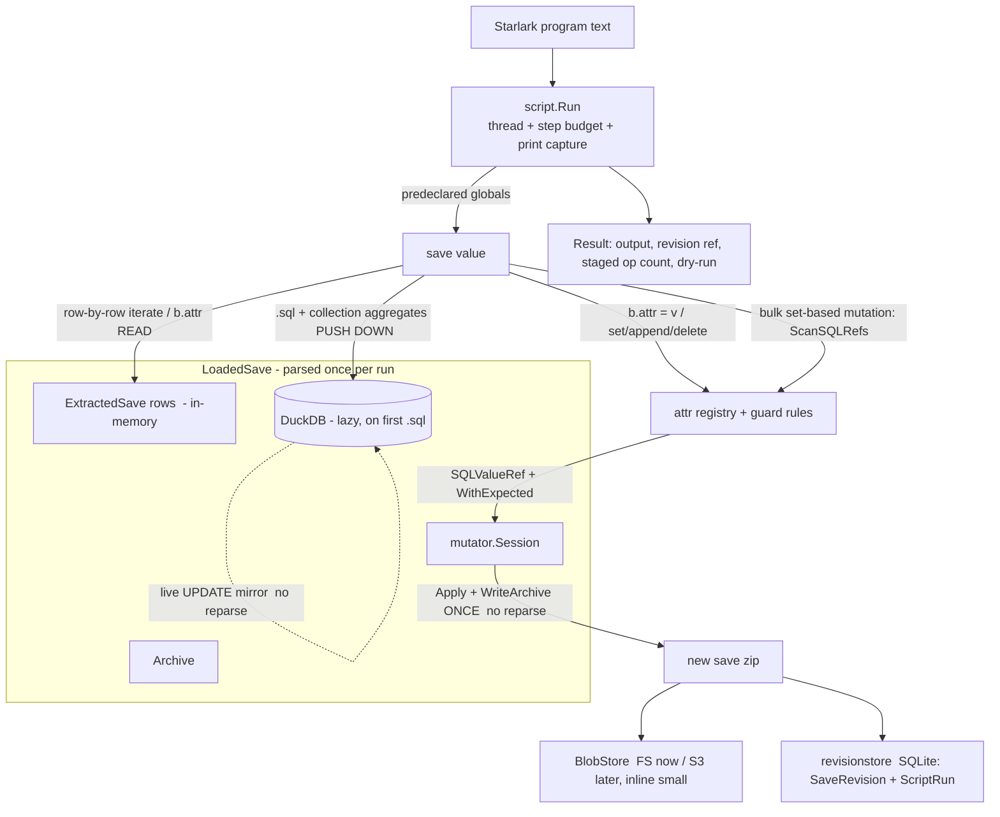

# Plan: Starlark scripting layer over Bibites saves (v1 — language core, one save)

## Context

`bibicontrol` is a Go control plane for The Bibites. Today users can parse a save
(`saveparser/thebibites` → lossless `Archive` + 40+ normalized tables), mutate it
through a staged `Session` (`savemutator/thebibites`), and query it via DuckDB
(`duckdb`). What's missing is the user-facing layer the README promises:
"mutate them through a DSL." We want a real scripting surface so people can
enumerate entities, query, compute, and mutate saves in code — not a rigid DSL.

This PR builds the **language core against a single save**. Workspaces/multi-save,
cross-save transfer, IPC commands, and brain-graph editing are left as thin,
documented seams (already half-present in the repo) and are explicitly out of scope
here, per the "language core on one save" decision and the README's warning against
oversized changes.

### Decision 1 — Host language: **Starlark** (`go.starlark.net`)

You asked for the Starlark-vs-Lua reasoning rather than a pre-made pick. Both are
pure-Go and cross-platform (important: repo bans BepInEx / must run on macOS-ARM).
The deciding factors favor Starlark:

- **Shape match.** Your conceptual examples *are* Starlark (`for b in save.bibites`,
  `dict.get`, `dict.setdefault`, `def`, comprehensions, `%`-formatting). The target
  audience is analytics-minded; Python idioms fit the "massive queries over
  workspaces" future direction. Lua is not Python-shaped and you said you dislike it.
- **Safety / hermeticity — the real differentiator.** Starlark has **no `while`,
  recursion disabled by default, no ambient I/O, frozen module globals, deterministic
  iteration**. For LLM-generated save-mutation scripts this gives near-free
  termination and reproducibility guarantees. Lua (gopher-lua) is a full language with
  `while`/recursion/coroutines — you must actively sandbox it (strip `os`/`io`/`debug`,
  install instruction-count hooks) to reach the same safety bar.
- **Replayability for the distributed future.** The architecture doc wants script runs
  "recordable and replayable." Starlark's determinism makes a recorded `ScriptRun`
  replay identically on another agent — a concrete win for the eventual coordinator.
- **Effort is a wash.** The bulk of the work is the domain bindings (`save.bibites`,
  attribute get/set, `save.sql`, mutators); that's identical for any host. So Starlark
  is not meaningfully more work than Lua.
- **The one Starlark limitation** — no unbounded loops — is acceptable: entity work is
  bounded iteration, and `save.sql(...)` is the escape hatch for anything set-shaped.
- **If LLM familiarity ever outweighs Python-shape**, `goja` (JS) is the natural swap;
  the engine package is structured so a second host could bind the same domain objects.

### Decision 2 — Blob persistence: file blobs + SQL metadata, S3-ready, small items inline

Per your answer: committed saves are written to a content-addressed **`BlobStore`**
(local filesystem now, S3 behind the same interface later); blobs below an inline
threshold are stored directly in the metadata row; revision/provenance **metadata
lives in SQL** (SQLite via pure-Go `modernc.org/sqlite`, matching the architecture
doc's "SQLite as operational source of truth" and the cgo-free cross-platform
constraint). Scope is just the revision/provenance tables, not the full operational
schema.

**Boundary (important):** the blobstore + revisionstore are a *downstream
persistence/provenance sink*, **not** part of the mutation path. They are touched
**only at commit time (T8)**: the mutator produces a normal save zip and these record
its bytes + metadata. The mutation machinery — `Session.StageSQLSet`, guards, the
DuckDB live-mirror, `Apply` + `WriteArchive` — never references them. Concretely, **T6
(mutations) commits to a plain temp file and has zero dependency on either store**; the
coupling appears only in T8. No "mutator layer" lives in the blobstore.

### New dependencies
- `go.starlark.net` (Starlark interpreter, pure Go).
- `modernc.org/sqlite` (pure-Go SQLite driver for `database/sql`, cgo-free).

## Architecture / data flow



**Two read paths, by intent.** Plain enumeration / single-entity attribute access is
served from the in-memory `ExtractedSave` (no DuckDB). **Anything analytical — scanning
many rows, math, aggregation, `GROUP BY` — pushes down to DuckDB**, which is a
vectorized, multi-threaded, in-process columnar engine: this is the non-slow path for
hundreds of thousands to millions of rows. The trap to avoid (and which this design
does *not* make primary) is materializing millions of `Bibite` Starlark values to
aggregate in the interpreter.

**Scale fast path (answers "scan millions + do math"):**
- `save.sql(query)` — raw DuckDB, first-class, the guaranteed-fast fallback for any
  analytical query (joins, `GROUP BY`, window functions, quantiles, arbitrary math).
- Entity collections are **query-backed**, not plain iterators. `save.bibites` carries a
  SQL source (table + standard joins + a `WHERE`). `.where("sql expr")` narrows it
  (returns a new unmaterialized collection); `.count()`, `.sum/mean/median/min/max(col)`,
  `.quantile(col, q)`, `.group_by(col)` **compile to `SELECT agg(col) FROM <source>
  WHERE <pred>`** and return scalars/dicts without materializing rows.
- **Bulk set-based mutation** runs through the same engine: `save.sql(<select locator
  cols>) → duckdb.ScanSQLRefs → Session.StageSQLSet(WithExpected)` mutates a whole result
  set in one staged batch, with stale-value guards, no per-object interpreter overhead.
- Host-side `median(list)`/`sum(list)` builtins remain, but only for small,
  already-materialized lists; iterating `save.bibites` materializes lazily/in batches and
  is for row-by-row logic, not aggregation.
- **Forward-compatible:** the same collection + `save.sql` API is what scales into the
  cross-save/workspace "millions across revisions" future via the architecture doc's
  DuckDB + Parquet analytics direction; v1 just points it at one save's in-memory DB.

**Churn-avoidance (your stated concern) is structural:** one `ParseFile` +
`ExtractTables` per run; DuckDB opened lazily on first `.sql()`/aggregate and then
reused; all mutations staged on a single `Session` and flushed by **one** write at the
end. Dry-run skips the write. See the next section for the in-run `query → mutate →
query` consistency model that avoids any mid-run reparse.

## Execution & consistency model (in-run read-after-write without reparse)

**Problem (grounded in the code).** Three facts make a naive `query → mutate → query`
loop on one save slow:
- `Session.Commit` (`savemutator/thebibites/session.go:182`) writes the zip **and
  reparses it** (`tb.WriteArchive` → `tb.ParseFile`). A full reparse per round-trip is the churn.
- `Session.Apply` updates only entry JSON/raw bytes; it explicitly leaves **parser
  projections invalid** until a reparse (`session.go:21-23`), and `ExtractTables`
  (`saveparser/thebibites/normalize.go:9`) reads those projections (`archive.Bibites`, …),
  **not** `entry.JSON`. So normalized rows cannot be cheaply re-derived from an applied
  archive — re-derivation is gated behind the expensive `ParseFile`.
- `Session.Stage` refuses to stage after `Apply` (`session.go:98`), so the only way the
  current lifecycle makes a staged mutation observable is a full `Commit` (reparse).

**Design: DuckDB is the live in-run view; the Session is an append-only staged journal.**
We never `Apply` mid-run. Each mutation is (a) staged on the Session for the eventual
single write, and (b) mirrored into the open DuckDB as a direct `UPDATE`, so later queries
observe it with **no reparse and no re-extract**.
- **Contract — snapshot + staged scalar writes.** In-run SQL sees the save as of run start
  plus every scalar/bulk `set` applied so far. Structural adds/deletes (append/delete
  entity, zone append/delete) are staged for commit and become visible only after commit —
  documented, not mirrored mid-run in v1.
- **Mirror = the same `SQLValueRef`, the other direction.** A `set` already yields
  `(table, column, locator, value)`: staging builds the archive op, and the mirror builds
  `UPDATE <table> SET <column> = ? WHERE save_id = ? AND <locator>` against the same
  normalized DuckDB schema. `where(...).set(...)` is a single set-based `UPDATE`.
- **Batched & deferred (no O(N²), no churn).** Per-`set` intents are buffered and DuckDB is
  marked dirty; the buffer is flushed **only when the next `.sql()`/aggregate runs** (or
  never, if no query follows), as **one `UPDATE … FROM (VALUES …)` per (table, column)**
  (grouped by column → type-homogeneous). A row-by-row `for b in …: b.x = …` followed by a
  query costs one batched flush, not N point-updates and not a reparse. Lazy DuckDB open
  flushes the pending buffer once right after import, so mutation/open ordering is irrelevant.

**Commit optimization (orthogonal).** The scripting persistence step (T8) commits with
`Session.Apply()` + `tb.WriteArchive(path, Session.Archive())` and **skips the
`tb.ParseFile` reparse** — DuckDB served every read and the run is over, so the fresh
projections `Commit` would return are unused. This removes the reparse half of the write
cost. Reparse-verify is opt-in (`--verify`, re-reading the written save to assert round-trip).

**No changes to the existing mutator.** The Session stays a pure staged journal (never
`Apply` until the final flush), so this needs no edits to tested `savemutator` code; the
mirror and write-only commit live entirely in the new binding/persistence layer.

## Tickets

Nine tickets, each independently shippable with its own tests and definition of done
(DoD), per the repo's per-PR testing discipline. Dependency graph:

```
T1 blobstore ─┐
              ├─► T8 persistence + provenance + CLI
T2 revisionstore (needs T1.Ref) ─┘
T3 engine ─► T4 read bindings ─┬─► T5 analytics
                               └─► T6 mutations + guards ─► T7 settings
                                                          └─► T8
T9 IPC seam (independent — only existing ipc/noderuntime)
```
Critical path: **T3 → T4 → T6 → T8**. T1/T2/T3/T9 can start in parallel.

---

### T1 — `blobstore/`: content-addressed blob storage
- **Status:** Resolved 2026-06-15 in isolation.
- **Goal:** durable, dedup'd storage for committed save bytes; FS now, S3-shaped later, small blobs inline.
- **Files:** `blobstore.go` — `type Store interface { Put(ctx, []byte) (Ref, error); Get(ctx, Ref) ([]byte, error); Has(ctx, Ref) (bool, error) }`, `Ref{ SHA256 string; Size int64; Inline []byte }`. `fsstore.go` — `FSStore` rooted at a managed dir, sharded `objects/ab/cd/<hash>`; blobs `< InlineThreshold` (e.g. 4 KiB) returned as `Inline` rather than written.
- **Resolution:** implemented `blobstore.Store`, `Ref`, and `FSStore`; `FSStore` now delegates filesystem blob I/O to Go CDK's `gocloud.dev/blob/fileblob` while preserving this package's content-addressed refs, sharded object keys, dedupe, inline-small-blob behavior, and verified reads. `FSStore.Close` releases the underlying bucket.
- **Deps:** none. **New module dep:** `gocloud.dev v0.45.0` (pinned because `v0.46.0` requires Go 1.25; this repo remains on Go 1.24).
- **DoD / tests:** put/get round-trip; identical content dedupes to one object; inline-threshold boundary returns inline vs writes file. S3 impl explicitly out of scope (interface kept clean).
- **Verification:** `GOMODCACHE=/tmp/bibicontrol-go-mod GOCACHE=/tmp/bibicontrol-go-build go test ./blobstore`.

### T2 — `revisionstore/`: SQLite revision + provenance metadata ("metadata in SQL")
- **Status:** Resolved 2026-06-16 in isolation.
- **Goal:** record every produced save revision and the script run that produced it.
- **Files:** `schema.sql` (embedded migration) — `save_revisions(id, sha256, size, parent_id, source_path, blob_ref, inline_blob BLOB NULL, script_run_id, created_at)`, `script_runs(id, script_sha256, started_at, finished_at, status, error, output, staged_ops, dry_run)`. `store.go` — `Open(path)` (applies migration), `RecordScriptRun`, `RecordRevision`, lookups by id/sha. Reuse the `//go:embed` + ordered-apply pattern from `duckdb/import.go`.
- **Resolution:** implemented `revisionstore.Store` over `database/sql` + pure-Go `modernc.org/sqlite`; added an embedded SQLite schema for `script_runs` and `save_revisions`; revisions persist `blobstore.Ref` metadata as JSON while storing inline bytes in `inline_blob`; lookups cover script run by ID, revision by ID, and revisions by SHA-256. `modernc.org/sqlite` is pinned to `v1.45.0`, the newest checked release that keeps `go 1.24.0`.
- **Deps:** T1 (stores a `blobstore.Ref`). **New module dep:** `modernc.org/sqlite v1.45.0` (pure-Go, cgo-free).
- **DoD / tests:** record + read back a run and its produced revision; parent linkage; inline-blob vs blob_ref path both persist and reload.
- **Verification:** `GOMODCACHE=/tmp/bibicontrol-go-mod GOCACHE=/tmp/bibicontrol-go-build go test ./revisionstore`; `GOMODCACHE=/tmp/bibicontrol-go-mod GOCACHE=/tmp/bibicontrol-go-build go test ./...`.

### T3 — `script/`: Starlark host engine (domain-neutral)
- **Status:** Resolved 2026-06-16 in isolation.
- **Goal:** a reusable, sandboxed Starlark runner with budgets and clean diagnostics; no Bibites types.
- **Files:** `engine.go` — `Run(ctx, program []byte, globals starlark.StringDict, opts Options) (Result, error)`: `starlark.Thread`, `thread.SetMaxExecutionSteps` (budget), `thread.Print` → captured buffer, `*starlark.EvalError` backtraces → diagnostics. `result.go` — `Result{ Output string; Diagnostics []Diagnostic; StagedOps int; RevisionRef string; DryRun bool }`.
- **Resolution:** implemented a domain-neutral `script` package with `Run`, `Options`, `Result`, `Diagnostic`, and `RunError`; the runner captures `print` output, uses `starlark.ExecFileOptions` with explicit `syntax.FileOptions`, enforces optional execution-step budgets through `Thread.SetMaxExecutionSteps`, propagates context cancellation through `Thread.Cancel`, and normalizes syntax/eval/budget/cancellation failures into clean diagnostics with source locations and eval backtraces.
- **Deps:** none. **New module dep:** `go.starlark.net v0.0.0-20260324133313-ffb3f39dd27a` (pinned to the newest checked commit before the upstream `go 1.25.0` module bump; this repo remains on Go 1.24).
- **DoD / tests:** trivial program prints + returns; step budget aborts a long bounded loop; syntax/eval error surfaces a clean diagnostic. (Starlark's lack of `while`/recursion gives hermeticity for free.)
- **Verification:** `GOMODCACHE=/tmp/bibicontrol-go-mod GOCACHE=/tmp/bibicontrol-go-build go test ./script`; `GOMODCACHE=/tmp/bibicontrol-go-mod GOCACHE=/tmp/bibicontrol-go-build go test ./...`.

### T4 — `script/thebibites/`: LoadedSave + read bindings (enumerate + attribute reads)
- **Status:** Resolved 2026-06-15 in isolation.
- **Goal:** load a save once and expose read-only entity enumeration and friendly attribute reads. First user-visible vertical slice (a script can read and print).
- **Files:** `loadedsave.go` — `Load(path) (*LoadedSave, error)` → `ParseFile` + `ExtractTables`; holds `*tb.Archive`, `tb.ExtractedSave`, lazily-opened `*sql.DB` (via `duckdb.OpenAndImport`), and a `*mutator.Session` (`mutator.NewSession(archive)`). `attr_registry.go` — **data-driven friendly-attribute table** assembled from `tb.NormalizedTables` + the generated `*ColumnPaths` maps, keyed by entity kind; each entry `{friendlyName, sourceTable, sourceColumn, writable, guard, alias}`; writability inferred from the `sqlrefresolver` tag; a small hand-maintained `overrides` map for renames/aliases (`Diet`→`diet`, brain `type_name`). `bibite_value.go` (reads only here) — `Bibite` `starlark.Value` + `HasAttrs`; `Attr(name)` resolves via registry against the in-memory joined `ExtractedSave` rows; `b.gene("Name")`. `collection.go` (iteration only here) — `EntityCollection` behind `save.bibites`/`save.eggs`, a lazy `starlark.Iterable` yielding `Bibite`. `save_value.go` (read attrs only). `bindings.go` — `Globals(ls)`.
- **Resolution:** implemented the `script/thebibites` package: `LoadedSave`/`Load` parse + extract a save once and hold the lazy `*sql.DB` (nil in T4) and `*mutator.Session` seams; a friendly-attribute `registry` built **entirely from `tb.NormalizedTables`** (identity table + 1:1 sub-tables joined by `entry_name`), so every generated column is readable with no hand-maintained allowlist and `attrSpec` carries an `attrCategory` seam for future joined sub-collections. `Entity` (shared by bibites/eggs) implements `starlark.HasAttrs` with data-driven `Attr`/`AttrNames` + a `gene()` builtin (lazy gene index); `EntityCollection` is a lazy `starlark.Iterable`/`Sequence`; `Globals(ls)` binds `save`. Reads are served from the in-memory `ExtractedSave` — DuckDB is never opened. Deviations: derived the registry from `NormalizedTables` alone (the `*ColumnPaths` maps are unexported and redundant); unified bibite/egg into one `Entity` type to avoid duplication.
- **Deps:** T3. **New module dep:** none beyond T3.
- **DoD / tests (fixtures in `testdata/saves/the-bibites/`):** enumerate `save.bibites`; read attributes match normalized values; arbitrary gene read; missing attr → clean error. No mutation, no DuckDB yet (iteration is in-memory). Tests assert the mechanism (sampled identity + sub-table columns round-trip, gene read, unknown attr → `nil`/diagnostic, end-to-end `script.Run`, `ls.db` stays nil), not an allowlist.
- **Verification:** `GOMODCACHE=/tmp/bibicontrol-go-mod GOCACHE=/tmp/bibicontrol-go-build go test ./script/thebibites`; `GOMODCACHE=/tmp/bibicontrol-go-mod GOCACHE=/tmp/bibicontrol-go-build go test ./...`.

### T5 — analytics: SQL push-down + raw `save.sql` + aggregate builtins
- **Goal:** the non-slow path for "scan many rows + do math" — push computation into DuckDB.
- **Files:** `sql.go` — lazy DuckDB open (flushing any pending mirror buffer once after import); `save.sql(query)` raw fallback → `list[dict]`; the push-down query builder; a **`flushMirror()` hook + dirty flag** called at the head of every query/aggregate so reads observe pending mutations (the buffer itself is filled by T6). Extend `collection.go` — `.where(expr)` (narrowed copy), `.count()`, `.sum/mean/median/min/max(col)`, `.quantile(col, q)`, `.group_by(col)`, each compiling to `SELECT agg(col) FROM <source> WHERE <pred>` (no row materialization). `aggregates.go` — free-standing `median/mean/sum/count/min/max` over Starlark iterables, **for small materialized lists only**, documented as such.
- **Deps:** T4. **New module dep:** none.
- **DoD / tests:** `save.sql` returns expected rows; push-down `where(...).median("energy")` and `group_by("species_id")` match equivalent raw `save.sql` and equal the host-side builtin over the materialized list; on the 1027-bibite fixture a `group_by` aggregate returns **without** hitting the `Bibite` row-materialization path (assert via a counter); DuckDB opened at most once per run and reused; flush hook is a no-op when nothing is dirty.

### T6 — entity mutations + guards (stage + commit-to-file + reparse)
- **Goal:** mutate entities safely, keep DuckDB consistent in-run without reparse, and produce a corrected save file. Complete write slice, verifiable without the blob/revision stack (writes a temp zip via `Session.Apply` + `tb.WriteArchive`, then reparses only the test assertion).
- **Files:** extend `bibite_value.go` — `HasSetField`; `SetField(name, v)` → registry lookup → guard → build `mutator.SQLValueRef` (locator `entry_name`/`body_id`) → `session.StageSQLSet(ref.WithExpected(oldVal), newVal)` **and record a mirror intent** `(table, column, locator, value)`. `mirror.go` — the deferred mirror buffer + `flushMirror()` (one `UPDATE … FROM (VALUES …)` per (table, column), grouped by column for type-homogeneity) called by T5's query hook; structural ops mark the buffer "structurally deferred" rather than mirroring (per the consistency contract). `save_value.go` — `.set/.append/.delete` generic mutators; `.commit(path)` (Apply + WriteArchive, no reparse) and dry-run. Bulk path in `sql.go` — `save.bibites.where(...).set(col, expr)` via `duckdb.ScanSQLRefs` → `[]SQLRefRow` → batched `StageSQLSet(row.Ref.WithExpected(row.CurrentValue), v)`, mirrored as a single set-based `UPDATE`. `guards.go` — `Rule{ReadOnly, Min/Max, Enum, Type}` checked before staging; seeded from column `value_type` + manual overrides (`species_id` referential, `dead`/`dying` bool-only, energy/health ≥ 0); bulk validates once per column.
- **Deps:** T4 (and T5 for the query/flush hook + bulk `where(...).set` path; if sequenced before T5, ship per-entity `SetField` + staging first and wire the mirror flush when T5 lands). **New module dep:** none.
- **DoD / tests:** `b.energy = x` → write temp → reparse shows field changed, unrelated entries keep SHA256; guard rejects out-of-range/readonly/wrong-type; stale-value guard fires when underlying value changed; **in-run `query → set → query` observes the new value with no `ParseFile` and no `ReplaceExtractedSave` (assert via reparse/re-import counters)**; **N row-by-row sets followed by one query flush as a single batched `UPDATE`, not N point-updates (assert statement count / not O(N²))**; bulk `where(...).set(...)` stages one batch and mirrors as one `UPDATE`; structural append is *not* visible to an in-run query but *is* present after commit; dry-run stages but writes nothing.

### T7 — `save.settings`: settings reads + writes
- **Goal:** named key/value settings access — a different shape from entity collections.
- **Files:** `settings_value.go` — `save.settings` namespace (`simulation`/`independent`/`material("X")`/`zones[i].values`). Reads from in-memory settings rows (`SettingsSimulationValues`, …), typed by `ScalarType`. Each read yields a `Setting` handle retaining its full locator (`entry_name`, `scope`, `owner_kind`, `owner_id`, `setting_name`, `path`, `wrapper_raw_json`, `value_type` — all present on `SettingValueRow`); `.set(value)` rebuilds the exact `SQLValueRef` → `session.StageSQLSet(ref.WithExpected(current), v)` through the existing `settings_value` resolver (`savemutator/thebibites/sqlref_settings.go`). Guards reuse `guards.go` keyed by `scope/setting_name`. Zones/materials/changers enumerable read-only.
- **Deps:** T6 (reuses guards + StageSQLSet + commit). **New module dep:** none.
- **DoD / tests:** `save.settings.simulation["maxBibiteCount"].set(v)` round-trips through reparse; wrapper-vs-bare value handled (`settingValueUsesWrapper`); guard rejects wrong-type; zone-scoped value write hits the right index.
- **Stretch (gate separately):** intra-save clone of a zone/material/changer via append of source `RawJSON` through the `settings_zone_path_map` append target (`sqlref_settings.go:227`).

### T8 — persistence + provenance + `cmd/bibiscript` CLI (end-to-end)
- **Goal:** wire commits into content-addressed storage + SQL provenance and expose a runnable CLI.
- **Files:** extend `loadedsave.go` — `Commit(blobstore, revisionstore, scriptRun)`: `session.Apply()` + `tb.WriteArchive(tmp, session.Archive())` (**no reparse**; opt-in `--verify` reparses to assert round-trip) → read bytes → `blobstore.Put` → `revisionstore.RecordRevision` linked to a `RecordScriptRun`. `cmd/bibiscript/main.go` — `bibiscript --save <in.zip> --script <prog.star> [--store <dir>] [--dry-run] [--verify]`: load, run, commit, print `Result`. Mirror existing `cmd/` style; keep thin.
- **Deps:** T1, T2, T6 (and benefits from T5/T7). **New module dep:** none beyond T1/T2.
- **DoD / tests:** running a mutation script produces a blob + `save_revisions`/`script_runs` rows; written save (re-read in the test) shows the change and unrelated entries byte-identical; `--dry-run` records a run with `dry_run=1` and writes no blob; **churn assertion — a pure-mutation script triggers exactly one `WriteArchive` and zero `ParseFile` reparses, and never opens DuckDB**; `--verify` adds exactly one reparse.

### T9 — thin IPC command seam (`control/`)
- **Goal:** typed client-side command definitions over the existing transport, ready for the DLL later.
- **Files:** `control/commands.go` — typed STOP/INFO/RESUME/RELOAD builders over `ipc.Envelope` via `noderuntime.Runtime.Request/Notify`, returning typed responses; small dispatcher/registry. DLL side stays out of scope (architecture doc).
- **Deps:** none (existing `ipc`/`noderuntime`). **New module dep:** none.
- **DoD / tests:** envelope-shape assertions against a fake/loopback session (no real DLL); unknown command rejected.

## Deferred (explicitly NOT in these tickets)
- Cross-save transfer: `savemutator/thebibites/workspace.go` `Workspace` is the seam. **Settings are the designated canonical first cross-save copy target** — the whole settings blob is one `tb.EntrySettings` entry, so "copy settings A→B" is a one-entry RawJSON transplant, far simpler than transplanting an entity with brain/genes. v2 workspace PR.
- Brain-graph editing, multi-save workspaces, distributed coordinator, headless LAUNCH/LOAD: v2.

## End-to-end verification (after T8)
1. `GOCACHE=/tmp/bibicontrol-go-build go test ./...` — all new packages + existing suites green.
2. Build `cmd/bibiscript`; run a sample `.star` (carnivore-speed example adapted to real attributes) against `testdata/saves/the-bibites/autosave_20260228004041.zip` with and without `--dry-run`; confirm a revision blob + SQLite rows are produced and the written save, re-read, shows the mutated field changed with unrelated entries byte-identical (`--verify` asserts the round-trip in one reparse).
3. Scale path on the 1027-bibite fixture: `save.bibites.group_by("species_id").median("energy")` returns without materializing `Bibite` values and matches the raw `save.sql` equivalent.
4. In-run consistency: a script doing `save.sql` → `set` → `save.sql` observes its own mutation, with instrumentation showing **zero `ParseFile` reparses and zero full `ReplaceExtractedSave` re-imports** during the run — only incremental `UPDATE`s.
